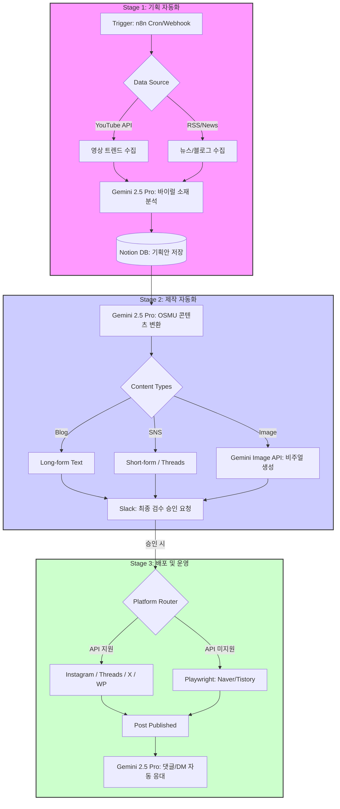
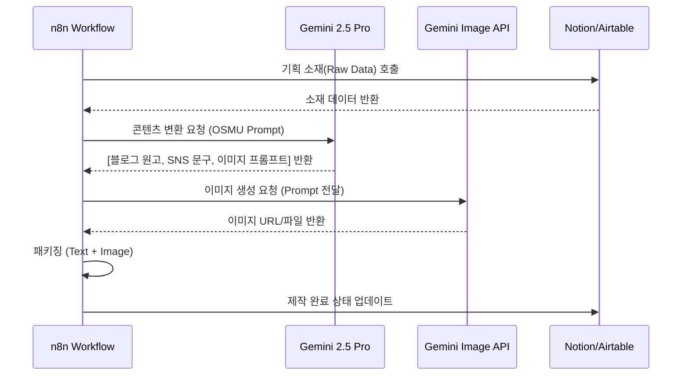
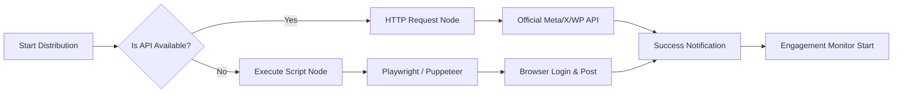

# SNS Automation System Architecture

이 문서는 n8n과 Gemini 2.5 Pro를 기반으로 구축된 SNS 및 블로그 자동화 시스템의 전체 구조를 Mermaid 다이어그램으로 시각화한 것입니다.

## 1. 전체 데이터 파이프라인 (Flowchart)

## 2. 콘텐츠 리퍼퍼징 시퀀스 (Sequence Diagram)

## 3. 하이브리드 배포 엔진 로직 (Decision Logic)

## 4. 핵심 기술 스택 요약
*   **Orchestration**: n8n
*   **AI Engine**: `@google/genai` (Gemini 2.5 Pro & Flash Image)
*   **Infrastructure**: Docker, Node.js, Playwright
*   **Auth**: `GEMINI_API_KEY` 환경변수 일원화 관리
